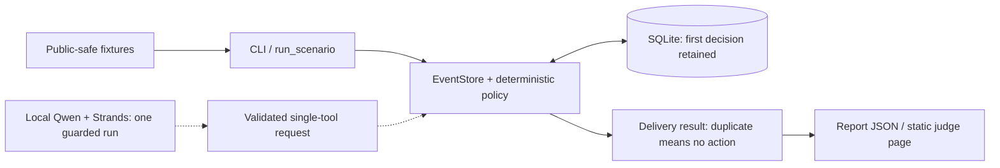

# Only When It Matters

Most contest updates do not need a human. Some deserve one exact next action.

**Only When It Matters** is a deterministic contest-attention prototype with a separate
Strands Agents SDK integration. It records routine evidence, classifies noise, and returns
actionable flags for selected events. Repeated event IDs return no second action, while the
original decision remains in an auditable SQLite ledger.

## Judge route

**Live fixture:** https://only-when-it-matters.gigantic-stranger.workers.dev/

**Narrated review demo (1:50):** https://youtu.be/0SPfU4ZGwm4
— fictional replay and separately recorded model results, not a live inbox or contest-submission claim.
Editable film source and narration provenance are in [demo-film](demo-film/README.md).

```bash
python -m venv .venv
.venv/bin/pip install -e '.[dev]'
.venv/bin/only-when-it-matters tests/fixtures.json
.venv/bin/pytest -q
```

The five deliveries contain four unique public-safe events: noise, a routine record, an
organizer request, a fictional winner notice, and its duplicate. The first two decisions are
quiet; the next two request attention. The duplicate has `interrupt_human: false` and
`exact_action: null`. Replay with `--database /tmp/owim-demo.sqlite3` to retain the ledger:
a second run returns only quiet duplicates, without overwriting the original decisions.

No model, cloud account, inbox access, or secret is required for this fixture route.

## Product truth

A contest operator loses focus when every update demands attention. This prototype tests a
small alternative: retain useful evidence, return an exact action for selected events,
and make retries quiet. Its scope is policy decisions, not notification delivery.

## Architecture

[Download the architecture PDF](site/architecture.pdf) · [Implementation boundaries](docs/architecture.md)



The fixture CLI calls the ledger and policy directly. It does **not** build a Strands agent,
call a model, or prove model-directed tool selection. `build_agent(model=...)` separately
registers two Strands-native tools. The new `run_guarded_request` route uses a fresh agent with
one allowed tool per request. Application hooks reject an extra call or changed input before
execution, validate the whole returned payload, and return deterministic JSON rather than model
final prose. One real local Qwen/Strands evaluation completed original triage, quiet retry and
metrics. The earlier unconstrained sequence failed; it is preserved in
[the bounded model proof](docs/model-proof.md), alongside the successful guarded run and a later
retrospective validation against hardened result checks. The public page is still a static fixture.

## Current proof

- Central duplicate suppression protects direct CLI and decorated Strands-tool callers.
- Original ledger bytes and unique-event metrics survive replay unchanged.
- Persistent-database reopening does not repeat the urgent action.
- Thirty-five tests cover policy, replay, persistence, actual SDK execution, twelve concurrent
  retries sharing one store, guarded tool batches, strict result validation, timeouts and injected
  failures before and after saving followed by a fresh request.
- One real local-model guarded sequence passed all three phases. This is not a reliability rate
  or demonstrated recovery from a live provider outage; injected recovery tests are separate.
- Static public replay plus a downloadable PDF; no paid model calls or external messages.

The legacy JSON metric `human_interruptions` counts unique `ESCALATE` decisions, not confirmed
notifications. `interruptions_avoided` counts unique non-escalation decisions. The fixture's
50% quiet-decision rate is a toy-scenario calculation, not measured productivity or impact.

## Limits and remaining work

Inputs are trusted fixture labels. The prototype does not authenticate senders, verify a winner
notice, read live mail, send notifications, accept terms, or establish a contest submission.
Reusing an ID for changed content still replays the original event; callers must assign stable,
unique delivery identities. A lock protects worker threads sharing one store. Separate store
instances/processes and exactly-once notification delivery are not supported guarantees.
Deadline freshness/expiry handling needs further validation. Guard preview and execution happen
at different times: a changing ledger or time-dependent result can fail closed. The recorded
organizer-event run does not establish acceptance stability for every event type. The legacy
`build_agent` route remains unconstrained; the new guarded route is the accepted demonstration.

Remaining entry work: broader model reliability validation, entrant and
AWS Builder ID verification, registration, final
release review, and provider-confirmed submission. Architecture packaging does not clear those gates.

## License

MIT — see [LICENSE](LICENSE). Public-safe fixtures are fictional; no personal inbox data is included.
