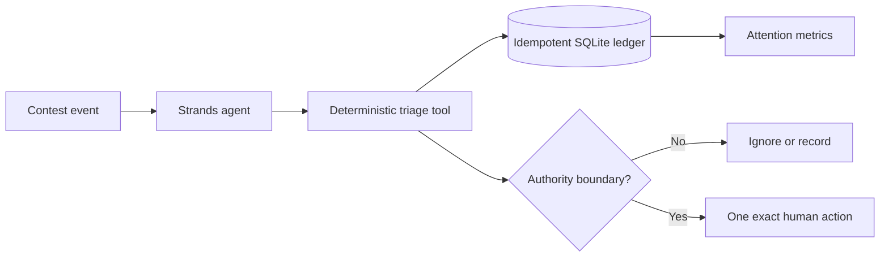

# Only When It Matters

Most contest operations do not need a human. Some absolutely do.

**Only When It Matters** is a Strands agent that separates routine delivery evidence from
real authority boundaries. It records confirmations and status changes quietly, rejects marketing
noise, deduplicates repeat events, and interrupts a person only for a deadline, organizer request,
eligibility action, acceptance, rejection, or verified win.

## Judge route

```bash
python -m venv .venv
.venv/bin/pip install -e '.[dev]'
.venv/bin/only-when-it-matters tests/fixtures.json
```

The fixture contains routine evidence, a false-positive/no-action case, two legitimate human
escalations, and a duplicate replay. The output measures both human interruptions and interruptions
avoided. No cloud account, paid model, inbox access, or secret is required.

## Product truth

A contest operator loses focus when every automated update demands attention. This agent turns a
stream of delivery events into a small, auditable queue whose silence is deterministic and whose
interruptions always contain an exact next action.

## Architecture



The Strands model interprets a user's request and selects tools. A deterministic policy owns the
consequential boundary; model prose cannot turn a routine event into a fabricated emergency. The
SQLite ledger makes retries idempotent and metrics replayable.

## Current proof

- New Strands Agents SDK project created during the contest window.
- Two Strands-native tools: event triage and campaign attention metrics.
- Four deterministic policy tests plus one end-to-end fixture replay.
- Explicit no-action, escalation, duplicate-recovery, and quantified-interruption cases.
- No AWS charges or external communications.

## Limits

This first vertical slice uses public-safe fixtures. It does not read live mail, send replies, accept
contest terms, or claim that a submission happened. A live provider adapter and free judge-facing
surface are the next build stage.

