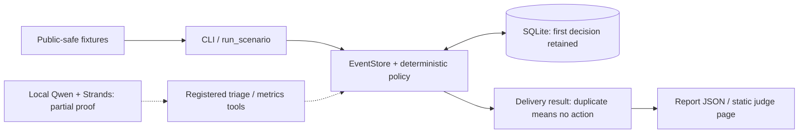

# Only When It Matters

Most contest updates do not need a human. Some deserve one exact next action.

**Only When It Matters** is a deterministic contest-attention prototype with a separate
Strands Agents SDK integration. It records routine evidence, classifies noise, and returns
actionable flags for selected events. Repeated event IDs return no second action, while the
original decision remains in an auditable SQLite ledger.

## Judge route

**Live fixture:** https://only-when-it-matters.gigantic-stranger.workers.dev/

```bash
python -m venv .venv
.venv/bin/pip install -e '.[dev]'
.venv/bin/only-when-it-matters tests/fixtures.json
.venv/bin/pytest -q
```

The five deliveries contain four unique public-safe events: noise, a routine record, an
organizer request, a fictional winner notice, and its duplicate. The first two decisions are
quiet; the next two request attention. The duplicate has `interrupt_human: false` and
`exact_action: null`. Replay with `--database /tmp/owim-demo.sqlite3` to retain the ledger:
a second run returns only quiet duplicates, without overwriting the original decisions.

No model, cloud account, inbox access, or secret is required for this fixture route.

## Product truth

A contest operator loses focus when every update demands attention. This prototype tests a
small alternative: retain useful evidence, return an exact action for selected events,
and make retries quiet. Its scope is policy decisions, not notification delivery.

## Architecture

[Download the architecture PDF](site/architecture.pdf) · [Implementation boundaries](docs/architecture.md)



The fixture CLI calls the ledger and policy directly. It does **not** build a Strands agent,
call a model, or prove model-directed tool selection. `build_agent(model=...)` separately
registers two Strands-native tools. A real local Qwen/Strands run successfully selected and
executed triage, including quiet retries. The strict sequence still failed because the model
called the retry tool twice instead of once; the final model-driven metrics phase was not reached.
See [the bounded model proof](docs/model-proof.md). The public page is still a static fixture.
The model prompt requests restraint, but no final-output enforcement prevents arbitrary
model prose. The deterministic guarantee applies to the tool's returned fields only.

## Current proof

- Central duplicate suppression protects direct CLI and decorated Strands-tool callers.
- Original ledger bytes and unique-event metrics survive replay unchanged.
- Persistent-database reopening does not repeat the urgent action.
- Eighteen tests cover policy, replay, persistence, the actual Strands worker-thread wrapper,
  twelve concurrent retries sharing one store, and rejection of invalid model-proof traces.
- Real local-model triage succeeded; the strict multi-phase probe remains FAIL, not end-to-end proof.
- Static public replay plus a downloadable PDF; no paid model calls or external messages.

The legacy JSON metric `human_interruptions` counts unique `ESCALATE` decisions, not confirmed
notifications. `interruptions_avoided` counts unique non-escalation decisions. The fixture's
50% quiet-decision rate is a toy-scenario calculation, not measured productivity or impact.

## Limits and remaining work

Inputs are trusted fixture labels. The prototype does not authenticate senders, verify a winner
notice, read live mail, send notifications, accept terms, or establish a contest submission.
Reusing an ID for changed content still replays the original event; callers must assign stable,
unique delivery identities. A lock protects worker threads sharing one store. Separate store
instances/processes and exactly-once notification delivery are not supported guarantees.
Deadline freshness/expiry handling needs further validation.

Remaining entry work: reliable complete model-directed sequence and failure recovery, entrant and
AWS Builder ID verification, registration, a narrated demo no longer than five minutes, final
release review, and provider-confirmed submission. Architecture packaging does not clear those gates.

## License

MIT — see [LICENSE](LICENSE). Public-safe fixtures are fictional; no personal inbox data is included.
